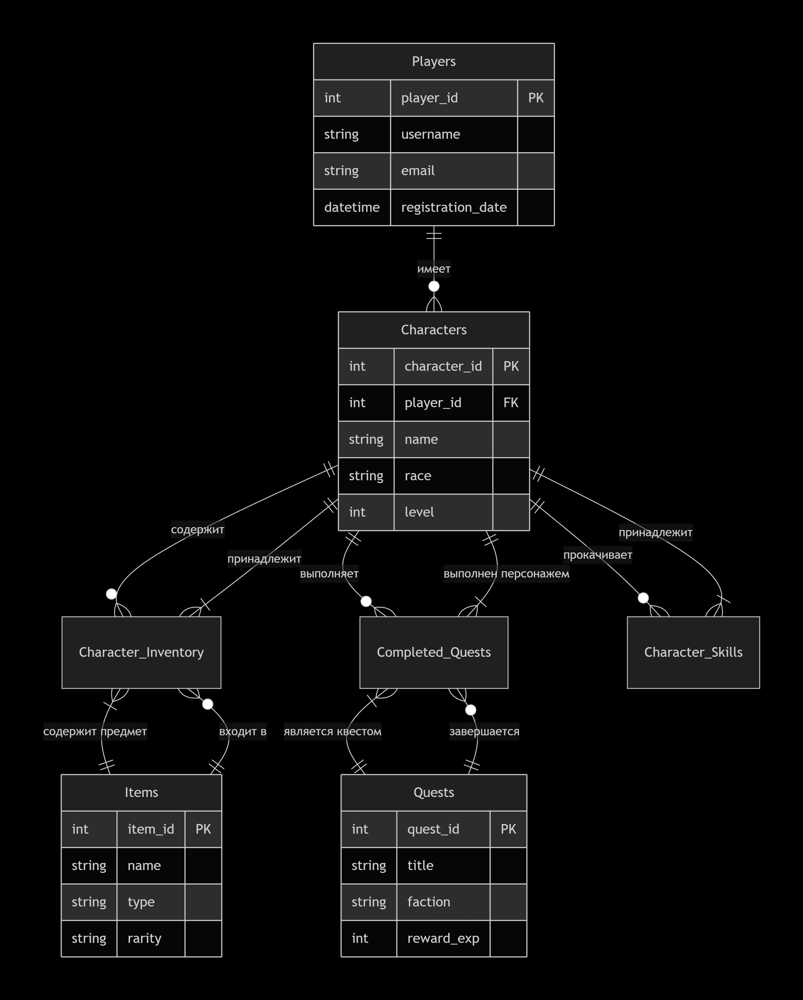

🎮 База данных для игры The Elder Scrolls V: Skyrim
📋 План структуры базы данных
🏛️ Основные сущности (таблицы)
1. Персонажи (Characters)
Поле	Тип данных	Описание
character_id	INT PRIMARY KEY	Уникальный ID персонажа
player_id	INT	ID игрока (внешний ключ)
name	VARCHAR(50)	Имя персонажа
race	VARCHAR(20)	Раса (Норд, Эльф, и т.д.)
gender	CHAR(1)	Пол (M/F)
level	INT	Уровень персонажа
health	INT	Здоровье
magicka	INT	Мана
stamina	INT	Выносливость
created_date	DATETIME	Дата создания
2. Игроки (Players)
Поле	Тип данных	Описание
player_id	INT PRIMARY KEY	Уникальный ID игрока
username	VARCHAR(30)	Имя пользователя
email	VARCHAR(100)	Электронная почта
registration_date	DATETIME	Дата регистрации
last_login	DATETIME	Последний вход
playtime_hours	INT	Общее время игры
3. Предметы (Items)
Поле	Тип данных	Описание
item_id	INT PRIMARY KEY	Уникальный ID предмета
name	VARCHAR(50)	Название предмета
type	VARCHAR(20)	Тип (оружие, броня, зелье, и т.д.)
rarity	VARCHAR(15)	Редкость (обычный, редкий, эпический)
weight	DECIMAL(5,2)	Вес
value	INT	Стоимость
required_level	INT	Требуемый уровень
4. Квесты (Quests)
Поле	Тип данных	Описание
quest_id	INT PRIMARY KEY	Уникальный ID квеста
title	VARCHAR(100)	Название квеста
description	TEXT	Описание квеста
faction	VARCHAR(30)	Фракция (дающая квест)
difficulty	VARCHAR(15)	Сложность (легкий, средний, сложный)
reward_exp	INT	Награда: опыт
reward_gold	INT	Награда: золото
is_main_quest	BOOLEAN	Основной сюжетный квест?
5. Локации (Locations)
Поле	Тип данных	Описание
location_id	INT PRIMARY KEY	Уникальный ID локации
name	VARCHAR(50)	Название локации
type	VARCHAR(20)	Тип (город, подземелье, лагерь)
region	VARCHAR(30)	Регион (Вайтран, Рифт, и т.д.)
x_coord	INT	Координата X
y_coord	INT	Координата Y
z_coord	INT	Координата Z
is_discovered	BOOLEAN	Локация открыта?
🔗 Таблицы взаимосвязей (Many-to-Many)
1. Инвентарь персонажа (Character_Inventory)
Поле	Тип данных	Описание
character_id	INT	ID персонажа (внешний ключ)
item_id	INT	ID предмета (внешний ключ)
quantity	INT	Количество
is_equipped	BOOLEAN	Надето ли?
condition	INT	Состояние предмета (1-100)
PRIMARY KEY (character_id, item_id)		
2. Выполненные квесты (Completed_Quests)
Поле	Тип данных	Описание
character_id	INT	ID персонажа (внешний ключ)
quest_id	INT	ID квеста (внешний ключ)
completion_date	DATETIME	Дата завершения
completion_time	INT	Время выполнения (в минутах)
choices_made	TEXT	Выборы, сделанные в квесте
PRIMARY KEY (character_id, quest_id)		
3. Навыки персонажа (Character_Skills)
Поле	Тип данных	Описание
character_id	INT	ID персонажа (внешний ключ)
skill_name	VARCHAR(30)	Название навыка
skill_level	INT	Уровень навыка (0-100)
experience	INT	Опыт в навыке
is_primary	BOOLEAN	Основной навык?
PRIMARY KEY (character_id, skill_name)

📊 Типы связей
Один ко многим (1:N):

Игрок → Персонажи (один игрок может иметь несколько персонажей)

Локация → Персонажи (в одной локации может быть несколько персонажей)

Многие ко многим (N:M):

Персонажи ↔ Предметы (через Character_Inventory)

Персонажи ↔ Квесты (через Completed_Quests)

Персонажи ↔ Навыки (через Character_Skills)

🎯 Примеры запросов
sql
-- Найти всех персонажей определенной расы выше 20 уровня
SELECT name, race, level 
FROM Characters 
WHERE race = 'Норд' AND level > 20 
ORDER BY level DESC;

-- Получить инвентарь персонажа с названиями предметов
SELECT c.name, i.name, ci.quantity, ci.is_equipped
FROM Character_Inventory ci
JOIN Characters c ON ci.character_id = c.character_id
JOIN Items i ON ci.item_id = i.item_id
WHERE c.character_id = 123;

-- Статистика по выполненным квестам по фракциям
SELECT q.faction, COUNT(*) as completed_quests
FROM Completed_Quests cq
JOIN Quests q ON cq.quest_id = q.quest_id
GROUP BY q.faction
ORDER BY completed_quests DESC;